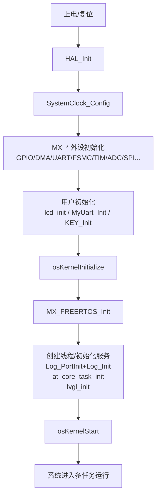

# SmartClock（SmartLock）开发者指南（总览）

本文用于“**不看代码也能理解**”项目的核心逻辑：启动链路、任务模型、模块边界、关键配置与扩展点。模块级指南见 `docs/developer-guide/modules/`。

## 1. 项目做什么

- 目标：在 **STM32F407** 上实现带屏幕的智能门锁面板：**触摸 UI + 本地开锁（指纹/RC522 RFID/密码）**，并预留 **Wi-Fi/MQTT** 联网能力（ESP-01S AT 框架）。
- GUI：LVGL（v8.x），RTOS：FreeRTOS（通过 CMSIS-RTOS2 包装层）。

## 2. 模块分层（建议按“职责”阅读）

- **Core（系统入口/RTOS/中断回调）**：`Core/Src/main.c`、`Core/Src/freertos.c`、`Core/Src/stm32f4xx_it.c`
- **Application（业务与 UI）**：`Application/Src/*`
- **Drivers/BSP（外设驱动）**：LCD/触摸/AS608/RC522/ESP01S/按键等
- **components（可复用组件）**：log、AT、ring_buffer、HFSM、OSAL、静态内存池等
- **platform（平台移植层）**：目前主要实现了 `hal_time` 的 STM32 端口

## 3. 启动与任务链路（Top-Down）

## 4. 运行时并发模型（必须遵守）

- **LVGL 单线程规则**：只有 `lvgl_handler_task` 允许直接调用 LVGL API；其它任务/中断需要更新 UI 时，必须 **`lv_async_call()` 回到 LVGL 线程**，或使用 `lvgl_lock()/lvgl_unlock()` 保护临界区。
- **串口回调集中转发**：
  - `HAL_UARTEx_RxEventCallback`：USART1 → DMA 数据入环形缓冲；USART3 → AT 框架收包
  - `HAL_UART_TxCpltCallback`：DMA 发送完成 → AT/Log 模块“发送完成”通知
  - `HAL_UART_RxCpltCallback`：AS608 1 字节接收回调转发（AS608 独立 UART）
- **按键逻辑拆分**：TIM6 中断只负责 `KEY_Tick_Handler()` 的计时驱动；任务线程周期调用 `KEY_Tasks()` 做状态机推进/回调。

## 5. 关键配置（跨模块）

| 配置项 | 位置 | 含义/影响 |
|---|---|---|
| `USED_STM32_PLATFORM` | `components/core_base/config_cus.h` | 启用 STM32 平台端口（当前主要用于 `hal_time`） |
| `TOUCH_POLL_INTERVAL_MS` | `components/core_base/config_cus.h` | 触摸采样周期（ms），影响触摸灵敏度与 CPU 占用 |
| `TOUCH_*_INVERT_X/Y` | `components/core_base/config_cus.h` | 触摸坐标镜像/方向修正（排查“点不准”优先看这里） |
| `LVGL_BUF_LINES` | `Drivers/BSP/lvgl_port/lvgl_port.c` | LVGL 行缓冲高度（行数），影响 RAM/刷新速度 |
| `DMA_BUFFER_SIZE`/`RINGBUFFER_SIZE` | `Application/Inc/Usart1_manage.h` | USART1 DMA 接收缓冲/环形缓冲大小（字节） |

## 6. 构建与产物（CMake）

> 本工程使用 `CMakePresets.json`（Ninja + `arm-none-eabi-gcc` 工具链）。

- 配置：`cmake --preset Release` 或 `cmake --preset Debug`
- 编译：`cmake --build --preset Release` 或 `cmake --build --preset Debug`
- 产物（示例）：`build/Release/SmartLock.elf`、`build/Release/SmartLock.hex`、`build/Release/SmartLock.bin`

## 7. 模块级开发者指南索引

- 系统入口与 RTOS：`docs/developer-guide/modules/core-startup-rtos.md`
- LVGL 集成与显示/触摸：`docs/developer-guide/modules/lvgl-integration.md`
- 主 UI（多模态门锁）：`docs/developer-guide/modules/ui-lock.md`
- 门锁业务数据（RFID/PIN 存储）：`docs/developer-guide/modules/lock-data.md`
- USART1 DMA→RingBuffer 数据通道：`docs/developer-guide/modules/uart1-dma-ringbuffer.md`
- 传感器与联网（Light/Water/ESP01S）：`docs/developer-guide/modules/sensors-and-network.md`
- 华为云 IoTDA（ESP-01S + AT + MQTT）：`docs/developer-guide/modules/cloud-huawei-iotda.md`
- 云端 MQTT 控制协议（云端下发/设备应答）：`docs/mqtt-control.md`
- 日志系统：`docs/developer-guide/modules/components-log.md`
- AT 框架（USART3）：`docs/developer-guide/modules/components-at.md`
- 指纹 AS608（端口+服务封装）：`docs/developer-guide/modules/drivers-as608.md`
- RFID RC522：`docs/developer-guide/modules/drivers-rc522.md`
- 按键（HFSM）：`docs/developer-guide/modules/drivers-keys.md`
- 可复用基础组件：`docs/developer-guide/modules/components-basics.md`
