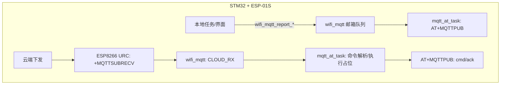

# 模块指南：华为云 IoTDA（ESP-01S + AT + MQTT）

## 模块目标

- 上电后由 ESP-01S 完成联网与 SNTP 校时（提供“epoch 秒”时间基准）。
- 基于时间戳生成鉴权信息，连接华为云 IoTDA 的 MQTT 接入点。
- 上报门锁事件（开门/关门/开锁方式/时间）。
- 接收云端控制命令（先实现可用的最小闭环：ping/time_sync/unlock/door；其他命令预留占位）。

## 代码位置

- 配置：`Application/Inc/huawei_iot_config.h`
- 鉴权与 topic 生成：`Application/Inc/huawei_iot.h`、`Application/Src/huawei_iot.c`
- MQTT 上云任务（AT 指令）：`Application/Inc/mqtt_at_task.h`、`Application/Src/mqtt_at_task.c`
- 本地事件邮箱队列：`Application/Inc/wifi_mqtt_task.h`、`Application/Src/wifi_mqtt_task.c`
- AT 框架（USART3）：`components/AT/AT.c`、`components/AT/AT_Core_Task.c`

## 启动链路（谁创建谁）

- `MX_FREERTOS_Init()` 中会初始化 AT Core：`at_core_task_init(&g_at_manager, &huart3);`
- AT Core 就绪后，会创建 MQTT 任务：`StartMqttAtTask()`（见 `components/AT/AT_Core_Task.c`）

## 必填配置

在 `Application/Inc/huawei_iot_config.h` 中填入（至少要改前两项）：

- `HUAWEI_IOT_DEVICE_ID`：设备 ID
- `HUAWEI_IOT_DEVICE_SECRET`：设备密钥
- `HUAWEI_IOT_MQTT_HOST`：IoTDA 区域接入点
- `HUAWEI_IOT_MQTT_PORT`：端口（默认 8883）
- `HUAWEI_IOT_MQTT_SCHEME`：0=TCP，1=TLS（取决于你的 ESP8266 AT 固件是否支持 TLS）

## AT 指令序列（关键步骤）

`Application/Src/mqtt_at_task.c` 的核心逻辑：

- 联网：调用 `esp01s_Init()`（内部可能触发 SmartConfig）
- 校时：
  - `AT+CIPSNTPCFG=1,8,"pool.ntp.org"`
  - `AT+CIPSNTPTIME?`（URC 中解析 `+CIPSNTPTIME:` 并写入 `lock_time_set_epoch_s()`）
- MQTT 连接：
  - `AT+MQTTUSERCFG=...`（client_id/username/password 由 `huawei_iot_build_mqtt_auth()` 生成）
  - `AT+MQTTCONN=...`
  - `AT+MQTTSUB` 订阅下行 topic（见下文）

## Topic 约定（本工程当前使用）

为方便你在云端直接用 MQTT 交互，本工程把“控制/事件”放在 IoTDA 的 user topic 下：

- 门事件上报（设备 -> 云）：
  - topic：`$oc/devices/<device_id>/user/events/door`
  - payload：见 `docs/mqtt-control.md`

- 控制命令下发（云 -> 设备）：
  - topic：`$oc/devices/<device_id>/user/cmd`
  - payload：见 `docs/mqtt-control.md`

- 控制命令应答（设备 -> 云）：
  - topic：`$oc/devices/<device_id>/user/cmd/ack`

同时，为后续接入 IoTDA 的标准“设备命令”机制，本工程也会订阅：

- `sys/commands/#`：`$oc/devices/<device_id>/sys/commands/#`

> 注意：IoTDA 标准属性上报通常是 JSON（`sys/properties/report`）。当前工程为了规避 ESP8266 `AT+MQTTPUB` 的引号转义问题，先用 user topic + `key=value` 格式跑通闭环；后续如切换 RAW 发布再升级到标准 JSON。

## 典型数据流

