# 模块指南：AT 框架（components/AT）

## 模块职责

- 在 USART3 上提供 **AT 命令发送/应答匹配/URC 处理**。
- 采用 **DMA Receive‑to‑Idle** 做接收，把数据拆为“行”，写入 ring buffer。
- RTOS 模式下通过 **Core Task + Flags/Queue** 做异步发送与超时管理。

相关路径：
- `components/AT/AT.h`、`components/AT/AT.c`
- `components/AT/AT_Core_Task.h`、`components/AT/AT_Core_Task.c`
- `components/AT/AT_UartMap.h`（UART→mgr 映射）

## 核心流程（收/发/超时）

```mermaid
flowchart TD
  subgraph RX[接收路径]
    A[USART3 DMA Idle 回调] --> B[AT_Core_RxCallback]
    B --> C[按行切分<br/>写 rx_rb + msg_len_rb]
    C --> D[置位 AT_FLAG_RX]
    D --> E[AT_Core_Task 触发 AT_Core_Process]
    E --> F[逐行 AT_OnLine<br/>匹配 OK/ERROR/URC]
  end

  subgraph TX[发送路径]
    T1[AT_Submit/AT_SendCmd] --> T2[cmd_q 入队]
    T2 --> T3[置位 AT_FLAG_TX]
    T3 --> T4[AT_Core_Task 出队并 hw_send]
    T4 --> T5[DMA TX done 回调]
    T5 --> T6[AT_Manage_TxCpltCallback<br/>置位 AT_FLAG_TXDONE]
  end

  subgraph TO[超时]
    X1[AT_Core_Task 周期检查 deadline] --> X2[超时则完成命令并释放 done_sem]
  end
```

## Public API 速查表

| 函数名 | 作用 | 关键参数 | 备注 |
|---|---|---|---|
| `at_core_task_init()` | 创建 AT Core Task 并初始化框架 | `AT_Manager_t*`, `UART_HandleTypeDef*` | 本项目在 `MX_FREERTOS_Init()` 调用 |
| `AT_Core_Init()` | 初始化 AT 管理器 | `mgr`, `uart`, `hw_send` | 会启动 USART DMA‑Idle 接收 |
| `AT_Core_RxCallback()` | USART3 DMA‑Idle 收包入口 | `mgr`, `huart`, `Size` | 在 `HAL_UARTEx_RxEventCallback` 转发 |
| `AT_Core_Process()` | 消费“完整行”并驱动状态机 | `mgr` | 由 Core Task 调用 |
| `AT_SendCmd()` | 阻塞式发送并等待结果 | `cmd`, `expect`, `timeout_ms` | 仅 RTOS 模式可用 |
| `AT_Submit()` | 提交命令（返回句柄） | `cmd`, `expect`, `timeout_ms` | 可实现非阻塞上层封装 |
| `AT_SendAsync()` | 提交命令（非阻塞） | 同上 | 需要上层轮询 `AT_Poll()` |
| `AT_SetUrcHandler()` | 绑定 URC 回调 | `cb`, `user` | 处理 `+IPD`、MQTT 推送等 |
| `AT_Manage_TxCpltCallback()` | DMA 发送完成通知 | `huart` | 在 `HAL_UART_TxCpltCallback` 转发 |
| `AT_BindUart()` / `AT_FindMgrByUart()` | UART→mgr 映射 | `huart` | 让 HAL 回调能找到对应 mgr |

## 关键参数（物理含义）

| 配置项 | 位置 | 含义/影响 |
|---|---|---|
| `AT_RTOS_ENABLE` | `components/AT/AT.h` | 1=启用 RTOS（队列/信号量/flags），0=裸机轮询 |
| `AT_TX_USE_DMA` | `components/AT/AT.h` | 1=DMA 发送，0=阻塞发送 |
| `AT_RX_RB_SIZE` | `components/AT/AT.h` | 接收 ring buffer 大小（字节，建议 2 的幂） |
| `AT_DMA_BUF_SIZE` | `components/AT/AT.h` | DMA 接收缓冲大小（字节） |
| `AT_CMD_TIMEOUT_DEF` | `components/AT/AT.h` | 默认命令超时（ms） |
| `AT_MAX_PENDING` | `components/AT/AT.h` | 同一串口并发排队的命令上限 |

## Design Notes（为什么这么写）

- **“按行”拆包**：AT 协议天然以 CRLF 行为单位，拆成行后更容易做 OK/ERROR/URC 匹配与超时控制。
- **Core Task 统一仲裁**：避免多任务同时访问 UART（帧交织）；所有发送与超时处理都集中在一个 task 中。
- **flags 而非 queue 唤醒 RX**：RX 是“事件驱动”，flags 更轻量；同时保留 10ms 小超时以便做 deadline 检查。

