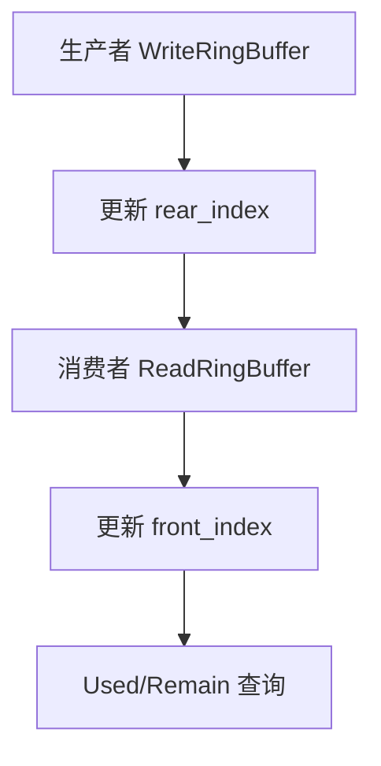

# 模块指南：基础可复用组件（ring_buffer / HFSM / memory_allocation / OSAL / hal_time）

本页把“基础组件”集中说明，避免每个小组件都写一份冗长指南；当你要移植/复用这些组件时，以这里为入口。

## 1) RingBuffer（components/ring_buffer）

### 核心流程（写入/读取）



### Public API 速查表（常用）

| 函数名 | 作用 | 关键参数 | 备注 |
|---|---|---|---|
| `CreateRingBuffer()` | 创建并分配缓冲区 | `rb`, `size` | size 建议为 2 的幂（可优化取模） |
| `WriteRingBuffer()` | 写入数据 | `add`, `size`, `isForceWrite` | 可选择强制覆盖策略 |
| `ReadRingBuffer()` | 读取数据 | `add`, `size`, `isForceRead` | |
| `RingBuffer_GetUsedSize()` | 已用字节数 | `rb` | |
| `RingBuffer_GetRemainSize()` | 剩余字节数 | `rb` | |
| `ResetRingBuffer()` | 清空缓冲 | `rb` | |
| `*FromISR()` | ISR 安全版本 | - | 在中断里用这些函数 |

### 关键参数

| 配置项 | 位置 | 含义 |
|---|---|---|
| `RING_BUFF_DEF_SIZE` | `components/ring_buffer/RingBuffer.h` | 默认大小（字节） |
| `DEFAULT_ALIGNMENT` | `components/ring_buffer/RingBuffer.h` | 内存对齐（字节） |

## 2) HFSM（components/hfsm）

### 核心概念

- `StateMachine` 持有 `current_state` 与 `customizeHandle`（让状态机可绑定到“按键对象”等业务句柄）。
- `State` 由 `on_enter/on_exit/event_actions/parent` 构成，支持层次状态机（parent）。
- `Event` 是 `{event_id, event_data}`，由外部驱动注入。

### Public API 速查表

| 函数名 | 作用 | 关键参数 | 备注 |
|---|---|---|---|
| `HFSM_Init()` | 初始化状态机 | `fsm`, `initial_state` | 设置初始状态并调用 entry |
| `HFSM_HandleEvent()` | 分发事件 | `fsm`, `event` | 查找 `event_actions` 并执行 handler |
| `HFSM_Transition()` | 状态跳转 | `fsm`, `new_state` | 负责 exit/enter 调用 |

## 3) 静态内存池（components/memory_allocation）

### 核心流程

```mermaid
flowchart TD
  A[static_alloc(size, align)] --> B[计算 padding]
  B --> C{剩余空间够吗?}
  C -->|否| D[返回 NULL]
  C -->|是| E[返回池内指针并推进索引]
```

### Public API 速查表

| 函数名 | 作用 | 关键参数 | 备注 |
|---|---|---|---|
| `static_alloc()` | 从静态池分配 | `size`, `alignment` | 不支持 free；适合“启动期一次性分配” |
| `query_remain_size()` | 查询剩余空间 | 无 | 调试内存紧张问题 |
| `static_alloc_reset()` | 重置池 | 无 | **会使旧指针失效**（谨慎） |

### 关键参数

| 配置项 | 位置 | 含义 |
|---|---|---|
| `MEMORY_POND_MAX_SIZE` | `components/memory_allocation/MemoryAllocation.h` | 静态池大小（注意：代码中按“字节数组”使用） |

## 4) OSAL（components/osal）与 hal_time（components/hal + platform）

- OSAL 目标：把 CMSIS‑RTOS2/FreeRTOS/裸机差异封装为统一 API（mutex/sem/msgq/thread/flags/time/critical）。
- `hal_time` 目标：提供 `ms/us` 时间戳；STM32 端口优先使用 DWT 周期计数获取 **us 级**时间，失败则退化到 `HAL_GetTick()*1000`。

### Public API 速查表（常用）

| 函数名 | 作用 | 关键参数 | 备注 |
|---|---|---|---|
| `OSAL_thread_create()` | 创建线程 | `fn`, `arg`, `attr` | AT Core Task 使用它创建任务 |
| `OSAL_thread_flags_set/wait()` | 线程 flags 同步 | `flags`, `timeout` | 事件驱动比队列更轻量 |
| `OSAL_mutex_*` / `OSAL_sem_*` | 互斥锁/信号量 | - | AT 框架命令池与完成通知使用 |
| `hal_get_tick_ms()` | ms 时间戳 | 无 | 直接 `HAL_GetTick()` |
| `hal_get_tick_us32()` | us 时间戳（32bit） | 无 | DWT 可用时精度更高 |

### Design Notes（为什么这么写）

- **DWT 计数器**：在 M4 上开销极低，适合做微秒级测量/超时；但部分场景 DWT 可能不可用，因此提供降级路径并只打印一次失败日志。

