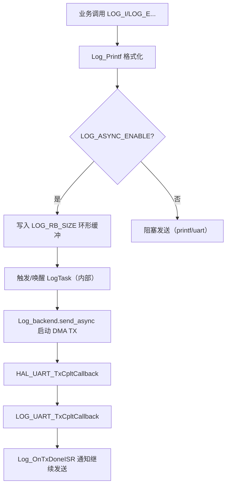

# 模块指南：日志系统（components/log）

## 模块职责

- 提供统一日志接口（等级/颜色/hex dump）。
- 支持 **异步发送**：日志写入环形缓冲，由后台机制驱动 DMA 发送，避免任务被 `HAL_UART_Transmit` 阻塞。

相关路径：
- `components/log/log.h`、`components/log/log.c`
- `components/log/log_port.h`、`components/log/log_port.c`

## 核心流程（异步发送）

## Public API 速查表

| 函数名 | 作用 | 关键参数 | 备注 |
|---|---|---|---|
| `Log_Init()` | 初始化日志系统 | 无 | RTOS 模式下应在创建任务后调用 |
| `Log_SetBackend()` | 设置发送后端 | `log_backend_t` | 本项目在 `Log_PortInit()` 里绑定 UART1 DMA |
| `Log_OnTxDoneISR()` | DMA TX 完成通知（ISR） | 无 | 由 port 层在回调里调用 |
| `Log_Printf()` | 打印格式化日志 | `level/file/line/tag/fmt...` | 一般通过宏 `LOG_I/...` 调用 |
| `Log_Hexdump()` | 打印十六进制 | `buf/len` | 用于调试二进制协议 |
| `LOG_E/LOG_W/LOG_I/LOG_D` | 日志宏 | `tag`, `fmt...` | **主要使用入口**（带 file/line） |

## 关键参数（物理含义）

| 配置项 | 位置 | 含义/影响 |
|---|---|---|
| `LOG_ASYNC_ENABLE` | `components/log/log.h` | 1=异步（推荐），0=阻塞发送 |
| `LOG_RB_SIZE` | `components/log/log.h` | 异步日志环形缓冲大小（字节） |
| `LOG_COLOR_ENABLE` | `components/log/log.h` | 开启 ANSI 颜色（串口终端可读性） |
| `LOG_CURRENT_LEVEL` | `components/log/log.h` | 编译期过滤等级（减小开销） |

## Design Notes（为什么这么写）

- **异步 + DMA**：日志属于“低优先级 I/O”，采用 DMA 发送可显著减少任务阻塞与 jitter。
- **port 层分离**：`log.c` 不绑定具体 UART；由 `log_port.c` 选择 UART1 并处理 TX 完成回调，便于换串口/换输出介质。
- **busy 标志防重入**：避免 DMA 尚未完成就再次启动发送导致 `HAL_BUSY` 与状态机错乱。

