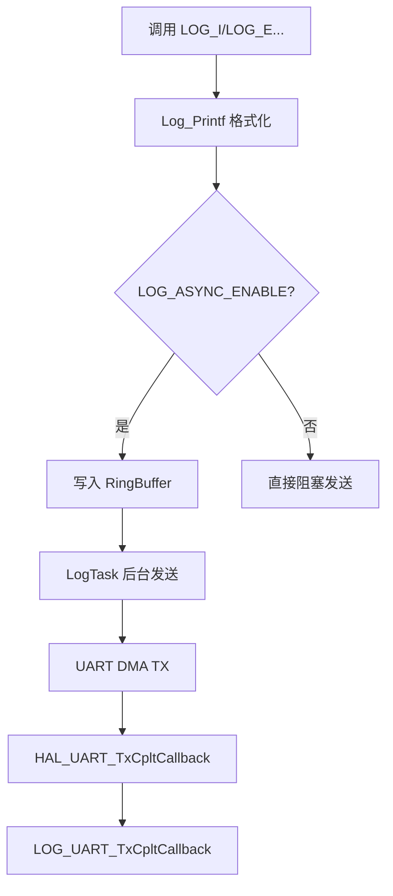

# 模块指南：日志系统（components/log）

日志系统目标：

- 统一的 `LOG_E/W/I/D` 接口（带 file/line/tag）
- 支持异步发送（RingBuffer + 后台线程 + UART DMA），减少业务线程阻塞
- 在 RTOS 未启动时也尽量可用（不依赖 mutex/线程）

相关路径：

- `components/log/log.h`、`components/log/log.c`
- `components/log/log_port.h`、`components/log/log_port.c`
- 静态内存池：`components/memory_allocation/MemoryAllocation.*`
- RingBuffer：`components/ring_buffer/RingBuffer.*`

## 1. 发送模型（同步 vs 异步）

## 2. 内存占用（非常关键）

日志异步 RingBuffer 的内存来自 **工程自定义静态内存池**，不是 FreeRTOS heap：

- 内存池大小：`MEMORY_POND_MAX_SIZE=8192`（单位是 bytes，见 `components/memory_allocation/MemoryAllocation.h:8`）
- RingBuffer 分配：`CreateRingBuffer()` → `static_alloc()`（见 `components/ring_buffer/RingBuffer.c:26`）

注意：

- 代码里有日志打印 “8192KB …”，这是历史注释/格式问题；实际是 bytes
- 如果静态池耗尽，RingBuffer 创建会失败，导致后续日志行为异常或降级

FreeRTOS heap（task/queue/semaphore 等动态对象）来自：

- `configTOTAL_HEAP_SIZE=36864`（见 `Core/Inc/FreeRTOSConfig.h`）

## 3. 端口层绑定（UART1 DMA）

本工程默认在 `Log_PortInit()` 里绑定 UART1 DMA 作为输出后端：

- backend 选择与 DMA TX done 回调在 `components/log/log_port.c`
- DMA 发送完成需要在工程统一回调处转发（通常在 `HAL_UART_TxCpltCallback`）

## 4. 为什么“堆不够”时可能没日志

常见现象：

- `configTOTAL_HEAP_SIZE` 不足导致创建任务/队列失败
- 日志系统是异步的，且可能在 RTOS 未启动前初始化不完全
- 某些错误发生在中断/临界区，日志无法安全输出

定位建议（比“等日志”更可靠）：

- 在 `Core/Src/freertos.c:vApplicationMallocFailedHook()` 打断点
- 在 `Core/Src/freertos.c:vApplicationStackOverflowHook()` 打断点
- 在 `configASSERT()` 打断点（`Core/Inc/FreeRTOSConfig.h`）

## 5. 使用建议（避免刷爆串口）

- 高频数据（如传感器 RAW）建议降低等级或限频
- `LOG_HEX` 会产生大量输出，联调 AT/MQTT 时建议先关闭

*** Delete File: docs/developer-guide/modules/components-at.md
