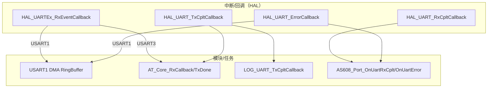

# 模块指南：系统入口与 RTOS（Core）

本模块负责三件事：

1) 上电启动链路（时钟、外设、RTOS）  
2) RTOS 线程/服务的创建与初始化顺序  
3) HAL 回调（中断上下文事件）集中转发到各模块（避免回调冲突）

相关路径：

- `Core/Src/main.c`
- `Core/Src/freertos.c`
- `Core/Src/stm32f4xx_it.c`

## 1. 启动链路（main → scheduler）

```mermaid
flowchart TD
  A[main()] --> B[HAL_Init + SystemClock_Config]
  B --> C[MX_* 外设初始化<br/>GPIO/DMA/UART/SPI/FSMC/TIM/ADC...]
  C --> D[用户初始化区<br/>lcd_init / MyUart_Init / KEY_Init ...]
  D --> E[osKernelInitialize]
  E --> F[MX_FREERTOS_Init]
  F --> G[创建线程 + 初始化服务<br/>Log/AT/LVGL/dev_init/lock_act...]
  G --> H[osKernelStart]
```

注意：

- TIM3（舵机 PWM）由 CubeMX 生成：`Core/Src/main.c` 中会调用 `MX_TIM3_Init()`  
- “用户初始化区”是你后续计划用 CubeMX 统一替换的重点（详见清单文档）

## 2. 线程创建（CubeMX + 自写扩展）

### 2.1 CubeMX 生成的 CMSIS-RTOS2 线程

当前在 `Core/Src/freertos.c:MX_FREERTOS_Init()` 创建：

- `KeyScanTask`：周期跑 `KEY_Tasks()`
- `uartTask`：消费 USART1 DMA RingBuffer（示例/占位）
- `lcdTask`：历史遗留 LCD 任务（注意与 LVGL 冲突，见下文）

这三者目前采用 **静态分配**（由 CubeMX 配置生成）：

- `KeyScanTaskBuffer` / `KeyScanTaskControlBlock`
- `uartTaskBuffer` / `uartTaskControlBlock`
- `lcdTaskBuffer` / `lcdTaskControlBlock`

> 提示：栈大小与单位、堆大小、内存池等 RTOS 关键参数见  
> `docs/developer-guide/modules/rtos-task-mem-inventory.md`

### 2.2 工程在 RTOS 初始化阶段额外启动的“服务”

仍在 `MX_FREERTOS_Init()` 的用户区启动：

- `Log_PortInit()` + `Log_Init()`：日志系统
- `LockDevices_Start()`：启动 `dev_init` 任务，初始化 AS608 service + RC522，并设置 ready 标志
- `LockActuator_Start()`：启动 `lock_act` 任务与队列（舵机开锁/关锁/自动回锁）
- `at_core_task_init(&g_at_manager, &huart3)`：AT core + MQTT_AT 线程
- `lvgl_init()`：创建 LVGL handler/tick 任务并初始化 UI

## 3. lcdTask 与 LVGL 的冲突说明（非常重要）

LVGL 已经接管 LCD 刷新（flush_cb 直接写 GRAM）。如果 `lcdTask` 仍在运行并且也在直接调用旧 LCD API：

- 可能造成花屏、互相抢占、甚至卡死

建议：

- 生产形态：禁用 `lcdTask`（或让它只做背光/状态灯，不做画图）
- 如果必须保留：保证 `lcdTask` 不调用任何 LCD 显存写入函数

## 4. HAL 回调集中转发（避免回调冲突）

典型回调与分发关系：



定位入口：

- `Core/Src/freertos.c:HAL_UARTEx_RxEventCallback`
- `Core/Src/freertos.c:HAL_UART_ErrorCallback`
- `Core/Src/freertos.c:HAL_UART_RxCpltCallback`

## 5. 为什么经常看到“RTOS 调度器没启动”

很多模块（Log/OSAL/Delay）在 `osKernelStart()` 之前也会被调用，此时：

- 不能阻塞等待 RTOS 对象
- 异步日志可能尚未启动

遇到“卡死但没日志”，优先用断点抓：

- `vApplicationMallocFailedHook()`（`Core/Src/freertos.c`）
- `vApplicationStackOverflowHook()`（`Core/Src/freertos.c`）
- `configASSERT()`（`Core/Inc/FreeRTOSConfig.h`）

*** Delete File: docs/developer-guide/modules/lvgl-integration.md
