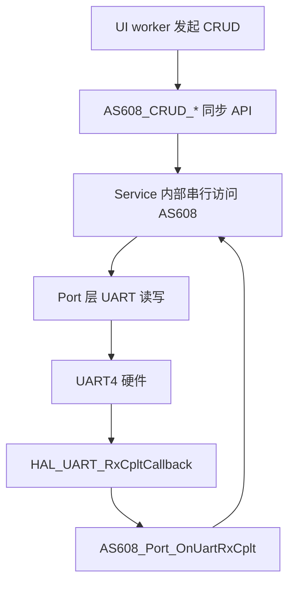

# 模块指南：AS608 指纹（端口层 + 服务封装）

## 模块职责

- `as608_port`：把 AS608 绑定到一条 UART，并将 HAL 回调转发到模块内部（避免回调冲突）。
- `as608_service`：对第三方驱动做 **任务化/串行化封装**，向上提供同步 CRUD API（Create/Read/Update/Delete/Clear）。

相关路径：
- `Drivers/BSP/as608/Core/Inc/as608_port.h`
- `Drivers/BSP/as608/Core/Inc/as608_service.h`
- 第三方驱动：`Drivers/BSP/as608/ThirdParty/LibDriver_AS608/*`

## 核心流程（UI/worker→Service→Port→UART）

## Public API 速查表

| 函数名 | 作用 | 关键参数 | 备注 |
|---|---|---|---|
| `AS608_Port_BindUart()` | 绑定 AS608 使用的 UART | `huart` | 建议 **独占 UART4** |
| `AS608_Port_StartRx()` | 启动 1 字节循环接收 | 无 | 通常在服务启动后调用一次 |
| `AS608_Port_OnUartRxCplt()` | 转发 RxCplt 回调 | `huart` | 在工程的 `HAL_UART_RxCpltCallback` 调用 |
| `AS608_Port_OnUartError()` | 转发 Error 回调 | `huart` | 可选，但推荐接入 |
| `AS608_Port_FlushRx()` | 清空 RX 缓冲 | 无 | 处理异常帧/重同步 |
| `AS608_Service_Init()` | 初始化服务与模块 | `addr`, `password` | 常用：`0xFFFFFFFF` / `0x00000000` |
| `AS608_CRUD_Create()` | 录入指纹到指定 id | `id`, `timeout_ms`, `out_status` | 录入通常 15~30s |
| `AS608_CRUD_Read()` | 搜索/验证指纹 | `timeout_ms`, `out_found_id`, `out_score` | 典型 8s |
| `AS608_CRUD_Delete()` | 删除指定 id | `id` | |
| `AS608_CRUD_ClearAll()` | 清空库 | - | |
| `AS608_List_IndexTable()` | 读取索引表 | `num`, `out_table[32]` | 用于“枚举已录入指纹” |
| `AS608_Get_Capacity()` | 查询容量 | - | UI 可用它做范围校验 |

## 关键参数（物理含义）

| 配置项 | 位置 | 含义/影响 |
|---|---|---|
| `addr`（默认 `0xFFFFFFFF`） | `AS608_Service_Init` 入参 | AS608 地址（广播/默认地址常用全 1） |
| `password`（默认 `0x00000000`） | `AS608_Service_Init` 入参 | 模块校验密码（默认全 0） |
| `timeout_ms` | `AS608_CRUD_*` 入参 | 总等待时间（含等待手指/通信），影响 UX 与失败判定 |

## Design Notes（为什么这么写）

- **串行化访问**：指纹模块协议对并发极其敏感，若多任务同时收发会造成帧交织；用服务层统一仲裁可避免“偶发错误/死锁”。
- **port 层隔离 HAL 回调**：工程只需要在一个地方转发回调，避免多个模块抢占 `HAL_UART_*Callback`。

