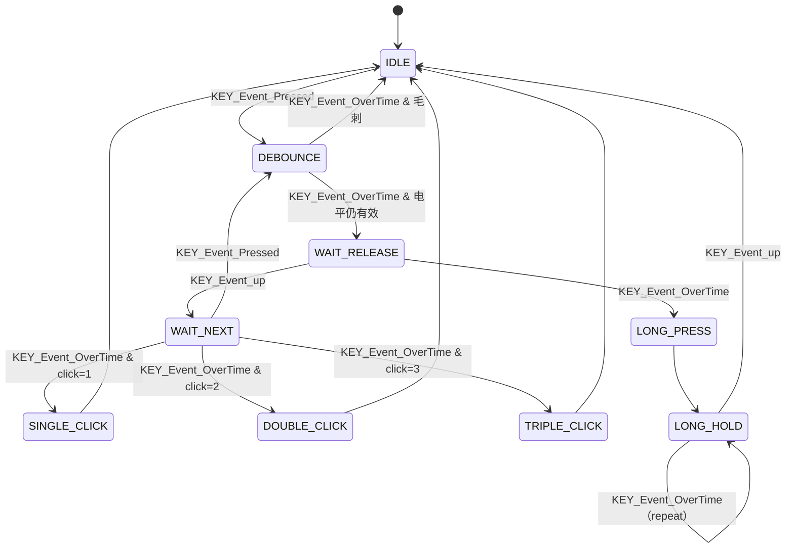

# 模块指南：按键系统（HFSM + TIM6 Tick）

## 模块职责

- 提供支持 **消抖 / 单击 / 双击 / 三击 / 长按 / 长按连发** 的按键识别。
- 使用 `components/hfsm` 的层次状态机（HFSM）实现，可读性和可扩展性更好。

相关路径：
- `Drivers/BSP/Keys/KEY.h`
- `Drivers/BSP/Keys/KEY.c`
- Tick 入口：`Core/Src/stm32f4xx_it.c`（TIM6 IRQ）

## 状态机（核心逻辑可视化）

## Public API 速查表

| 函数名 | 作用 | 关键参数 | 备注 |
|---|---|---|---|
| `KEY_Init()` | 注册一个按键实例 | `KEY_TypedefHandle*`, `KEY_Config_t*` | 可配置 active_level、debounce/long/multi ms、回调 |
| `KEY_Tick_Handler()` | Tick 驱动（计时/超时事件） | 无 | **应在固定周期中断调用**（本项目 TIM6） |
| `KEY_Tasks()` | 状态机推进与回调触发 | 无 | 由任务周期调用（本项目 KeyScanTask） |

## 关键参数（物理含义）

| 配置项 | 位置 | 含义/影响 |
|---|---|---|
| `debounce_ms` | `KEY_Config_t` | 消抖时间（ms）；太小会误触发，太大响应慢 |
| `long_press_ms` | `KEY_Config_t` | 长按阈值（ms） |
| `multi_click_ms` | `KEY_Config_t` | 多击窗口（ms）；决定双击/三击判定 |
| `active_level` | `KEY_Config_t` | 按键有效电平（0=低有效） |

## Design Notes（为什么这么写）

- **HFSM 更适合复杂按键语义**：相比 if‑else 堆叠，状态机能把“计时点/事件触发/转移条件”显式化，易于加新动作（如四击）。
- **中断只做 Tick**：保证中断短小可控；真正的回调（可能打印日志/改 UI）放在任务线程执行更安全。

