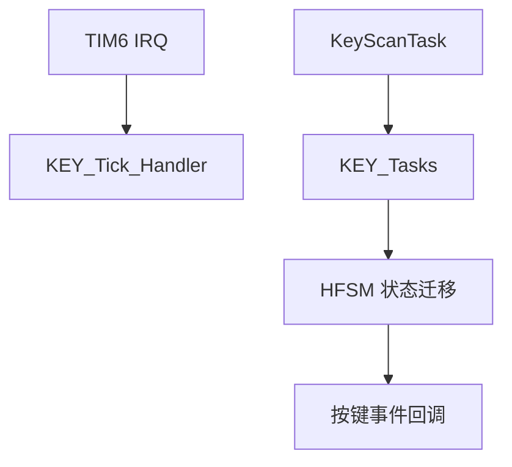

# 模块指南：按键（KEY + HFSM）

本模块把 GPIO 按键封装为可复用的“事件/状态机”驱动，特点：

- 支持消抖、短按、长按、多击（由状态机扩展）
- 中断侧只做“tick”，逻辑推进在任务线程中完成（降低中断开销）

相关路径：

- `Drivers/BSP/Keys/KEY.h`
- `Drivers/BSP/Keys/KEY.c`
- HFSM：`components/HFSM/*`
- 创建/初始化：`Core/Src/main.c`（`KEY_Init`）
- 任务推进：`Core/Src/freertos.c`（`KEY_Tasks()`）

## 1. 初始化

当前工程在 `Core/Src/main.c` 的用户区初始化三个按键：

- `KEY_Init(&key0, &key0_config);`
- `KEY_Init(&key1, &key1_config);`
- `KEY_Init(&key2, &key2_config);`

引脚定义来自 `Core/Inc/main.h`：

- `KEY0_Pin/KEY1_Pin/KEY2_Pin`（GPIOE）

## 2. 两段式驱动模型（推荐写法）

### 2.1 tick（中断侧）

工程使用定时器中断（TIM6）周期调用 `KEY_Tick_Handler()`（定位见 `Core/Src/stm32f4xx_it.c`）。

目的：

- 统一采样节奏
- 中断侧只做计时/采样，不做复杂逻辑

### 2.2 tasks（任务侧）

`KeyScanTask`（CMSIS-RTOS2）周期调用 `KEY_Tasks()` 推进状态机并触发回调（见 `Core/Src/freertos.c`）。

## 3. 事件流示意

## 4. WakeUp（PA0-WKUP）说明

PA0 在 `SmartLock.ioc` 中配置为 `SYS_WKUP`（系统唤醒功能），不再作为普通 GPIO 输入生成 `wake_up_Pin` 宏。

如果你要做“外部唤醒 + 低功耗”，建议：

- 以 CubeMX 的 SYS/WKUP 模式为准
- 在论文/系统设计中把 WakeUp 作为“低功耗唤醒源”描述，而不是按键驱动的一部分

*** Delete File: docs/developer-guide/modules/lock-data.md
