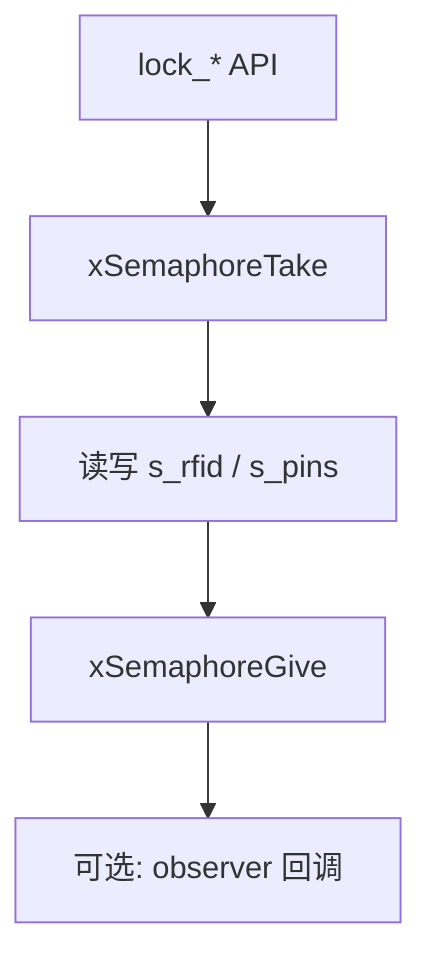

# 模块指南：门锁业务数据（RFID / PIN）

`lock_data` 提供一套“线程安全的内存态凭据库”，用于 UI/worker/云端逻辑共享同一份数据模型：

- RFID 白名单（UID + 名称 + 启用状态）
- PIN 密码（数字串 + TTL + 启用状态）
- observer 回调（数据变化时通知 UI 刷新）

相关路径：

- `Application/Inc/lock_data.h`
- `Application/Src/lock_data.c`

## 1. 数据模型（概念层）

### 1.1 RFID

一条 RFID 记录通常包含：

- `uid[LOCK_RFID_UID_LEN]`（当前按 RC522 常见 4 字节 UID）
- `name`（可选）
- `enabled`（是否启用）

典型业务：

- “刷卡校验”：`lock_rfid_verify_uid(uid)`
- “录入/删除”：在 UI 管理页调用 add/remove/clear

### 1.2 PIN

一条 PIN 记录通常包含：

- `pin_digits`（只允许数字字符）
- `ttl_minutes`（可选，过期后自动视为无效）
- `enabled`
- `id`（用于稳定 CRUD 标识）

典型业务：

- “输入校验”：`lock_pin_verify(pin_digits, &out_id)`
- “管理”：add/remove/clear/list

## 2. 线程安全策略

内部使用 mutex 保护：

原则：

- `lock_data` 不依赖 LVGL（保持业务层纯净）
- UI 收到 observer 再决定如何刷新界面

## 3. API 速查（常用）

| API | 作用 | 备注 |
|---|---|---|
| `lock_data_init()` | 初始化互斥锁 | 可重复调用 |
| `lock_data_set_observer(cb, user_ctx)` | 注册变更通知 | UI 用于刷新列表 |
| `lock_time_now_s()` | 当前秒 | SNTP 成功时可为 epoch 秒 |
| `lock_rfid_add_uid(uid, name_opt)` | 添加 UID | 幂等：已存在也返回 true |
| `lock_rfid_remove_uid(uid)` | 删除 UID | |
| `lock_rfid_clear()` | 清空 RFID | |
| `lock_pin_add(pin, ttl, name_opt, out_id)` | 添加 PIN | 只允许数字；ttl 可为 0 |
| `lock_pin_verify(pin, out_id)` | 校验 PIN | 会检查 TTL/启用状态 |
| `lock_pin_remove(id)` | 删除 PIN | |
| `lock_pin_clear()` | 清空 PIN | |

## 4. 与云端/后端的数据对齐建议（论文/Flutter 用）

固件侧 `lock_data` 只做“本地凭据校验”，不负责多用户权限与审计。  
如果后端需要实现用户体系，建议：

- 后端存储“用户 ↔ 设备权限 ↔ 操作记录”
- 固件只上报 door event（open/close + method + ts），后端负责落库与关联用户

对接协议见：

- `docs/mqtt-control.md`

*** End Patch"}"}*** End Patch"}"}*** End Patch in JSON?? Wait misuse. I must provide freeform patch not JSON. Let's craft correct patch. We'll call apply_patch with FREEFORM, no JSON.
