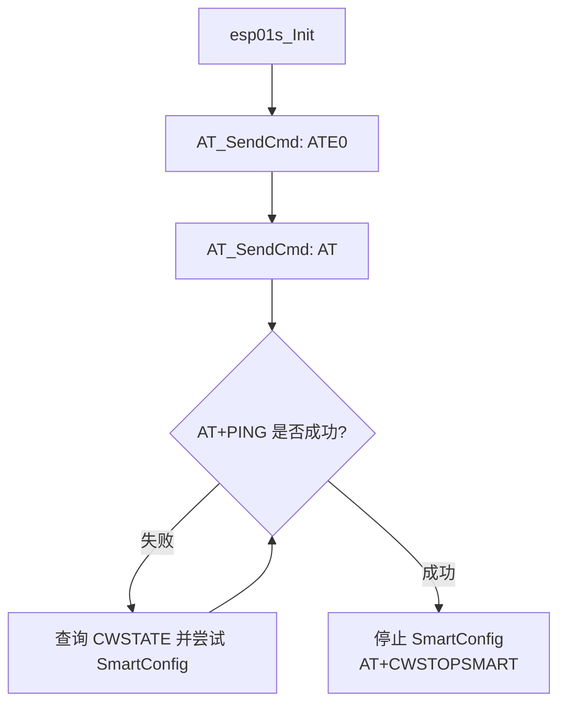

# 模块指南：传感器与联网（光敏/水滴 ADC/ESP01S）

## 模块职责

- 光敏：周期读取 ADC3，输出日志（可扩展为自动背光/夜间模式）。
- 水滴/液体：通过 VREFINT 换算 VDDA，再读取 ADC1 通道 1，显示原始值与换算电压。
- 联网：ESP‑01S 通过 AT 框架在 USART3 上联调（SmartConfig/联网检测）；MQTT 任务目前为占位（文件为空）。

相关路径：
- 光敏任务：`Application/Src/Light_Sensor_task.c`、`Application/Inc/Light_Sensor_task.h`
- 光敏驱动：`Drivers/BSP/Light_Sensor/LightSeneor.c`、`Drivers/BSP/Light_Sensor/LightSensor.h`
- 蜂鸣器：`Drivers/BSP/Beep/Beep.h`、`Drivers/BSP/Beep/Beep.c`
- 水滴 ADC：`Application/Src/water_adc.c`、`Application/Inc/water_adc.h`
- ESP01S：`Drivers/BSP/ESP01s/ESP01S.h`、`Drivers/BSP/ESP01s/ESP01S.c`
- 占位：`Application/Src/wifi_mqtt_task.c`、`Application/Src/mqtt_at_task.c`（当前长度为 0）

## 光敏任务流程（1s 周期）

```mermaid
flowchart TD
  A[StartLightSensorTask] --> B[LightSensor_Init]
  B --> C[循环]
  C --> D[LightSensor_Read -> LightSensor_Data]
  D --> E[可选：Beep_control/背光控制]
  E --> F[LOG_D 输出]
  F --> G[osDelay(1000)]
  G --> C
```

## 水滴/液体 ADC 流程（VDDA 自校准）

```mermaid
flowchart TD
  A[waterSensor_task] --> B[循环]
  B --> C[measure_vdda_mv<br/>读 VREFINT]
  C --> D[read_adc_single(ADC_CHANNEL_1)]
  D --> E[raw -> sensor_mv = raw * vdda_mv / 4095]
  E --> F[显示：raw / sensor_mv / vdda_mv]
  F --> G[osDelay(200)]
  G --> B
```

## ESP01S 联调流程（基于 AT 框架）



## Public API 速查表

| 函数名 | 作用 | 关键参数 | 备注 |
|---|---|---|---|
| `StartLightSensorTask()` | 光敏任务入口 | `argument` | RTOS 线程入口函数 |
| `LightSensor_Init()` | 启动 ADC3 | 无 | 当前实现每次循环都会调用一次（可优化） |
| `LightSensor_Read()` | 读取 ADC3 值 | 无 | 轮询转换完成（10ms 超时） |
| `Beep_control()` | 控制蜂鸣器 | `state` | 可在低光/告警时使用 |
| `waterSensor_task()` | 水滴 ADC 任务入口 | `argument` | 使用 ADC1 轮询采样 |
| `esp01s_Init()` | ESP01S 联调入口 | `huart`, `rb_size` | 实际发送走 `AT_SendCmd`（依赖 AT 框架已就绪） |
| `command_send()` | 发送命令并等待响应 | `command`, `wait_rsu`, `max_wait_time` | 当前更推荐统一走 AT 框架接口 |

## 关键参数（物理含义）

| 配置项 | 位置 | 含义/影响 |
|---|---|---|
| `VREFINT_TYPICAL_MV` | `Application/Src/water_adc.c` | 内部参考电压典型值（mV），用于 VDDA 估算 |
| `ADC_TIMEOUT_MS` | `Application/Src/water_adc.c` | ADC 轮询超时（ms） |
| `ADC_FULL_SCALE` | `Application/Src/water_adc.c` | ADC 满量程（12bit=4095） |

## Design Notes（为什么这么写）

- **VDDA 自校准**：用 VREFINT 估算实际 VDDA，能把“原始 ADC 码值”换算为更可解释的“电压（mV）”，便于阈值标定。
- **LCD 直写与 LVGL 的冲突**：`water_adc.c` 直接调用 `lcd_show_num()`；当 LVGL 接管 LCD 时，**不应在其它任务里直接画屏**，否则会出现显示撕裂/互相覆盖。推荐做法：把数据采样放在任务里，UI 显示用 `lv_async_call()` 回到 LVGL 线程更新。
- **联网任务占位**：`wifi_mqtt_task.*`、`mqtt_at_task.*` 当前为空；建议在补齐实现前，先明确“AT 层负责连接维护、MQTT 层负责协议与重连策略”的边界。

