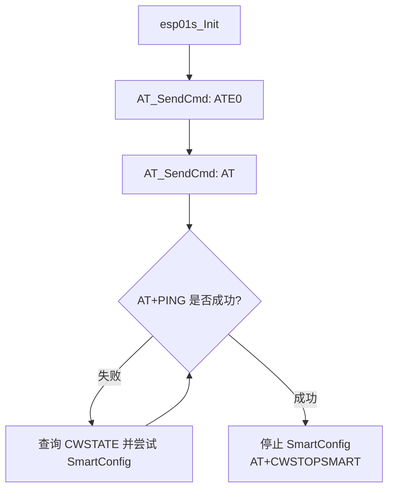
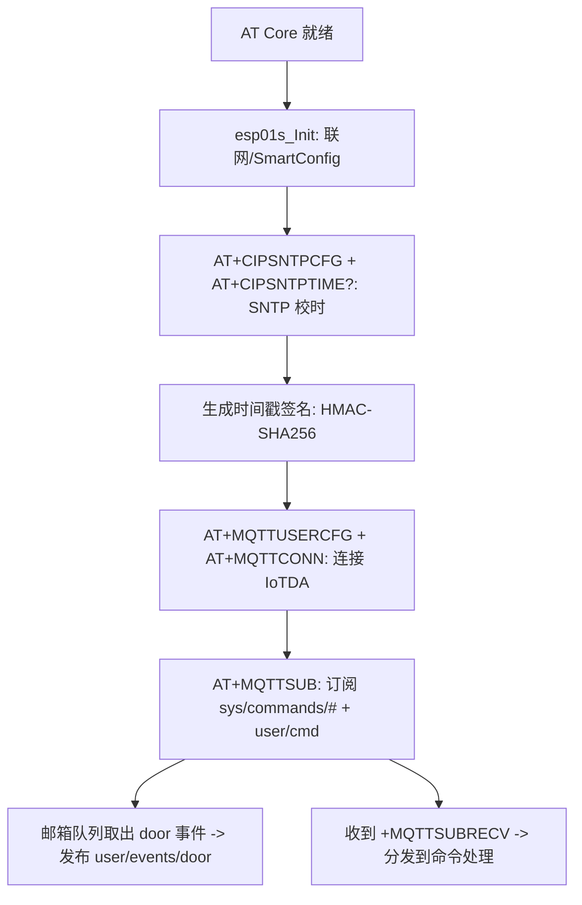

# 模块指南：传感器与联网（光敏 / 水滴 ADC / ESP01S）

## 模块职责

- 光敏：周期读取 ADC3，输出日志（可扩展为自动背光/夜间模式）。
- 水滴/液体：通过 VREFINT 换算 VDDA，再读取 ADC1 通道 1，输出原始值与换算电压。
- 联网：ESP-01S（ESP8266 AT）通过 AT 框架在 USART3 上联调并自动联网；在此基础上完成 SNTP 校时、MQTT 上云、云端命令下发与门事件上报。

## 相关路径

- 光敏任务：`Application/Src/Light_Sensor_task.c`、`Application/Inc/Light_Sensor_task.h`
- 光敏驱动：`Drivers/BSP/Light_Sensor/LightSeneor.c`、`Drivers/BSP/Light_Sensor/LightSensor.h`
- 水滴 ADC：`Application/Src/water_adc.c`、`Application/Inc/water_adc.h`
- ESP01S：`Drivers/BSP/ESP01s/ESP01S.h`、`Drivers/BSP/ESP01s/ESP01S.c`
- AT 框架：`components/AT/AT.c`、`components/AT/AT_Core_Task.c`
- MQTT（邮箱队列）：`Application/Inc/wifi_mqtt_task.h`、`Application/Src/wifi_mqtt_task.c`
- MQTT（AT 上云任务）：`Application/Inc/mqtt_at_task.h`、`Application/Src/mqtt_at_task.c`
- 华为云 IoTDA 辅助：`Application/Inc/huawei_iot_config.h`、`Application/Inc/huawei_iot.h`、`Application/Src/huawei_iot.c`

## 相关文档

- 华为云 IoTDA + MQTT：`docs/developer-guide/modules/cloud-huawei-iotda.md`
- MQTT 控制命令（云端交互协议）：`docs/mqtt-control.md`

## 光敏任务流程（1s 周期）

```mermaid
flowchart TD
  A[StartLightSensorTask] --> B[LightSensor_Init]
  B --> C[循环]
  C --> D[LightSensor_Read -> LightSensor_Data]
  D --> E[可选：Beep_control/背光控制]
  E --> F[LOG 输出]
  F --> G[osDelay(1000)]
  G --> C
```

## 水滴/液体 ADC 流程（VDDA 自校准）

```mermaid
flowchart TD
  A[waterSensor_task] --> B[循环]
  B --> C[measure_vdda_mv<br/>读 VREFINT]
  C --> D[read_adc_single(ADC_CHANNEL_1)]
  D --> E[raw -> sensor_mv = raw * vdda_mv / 4095]
  E --> F[显示：raw / sensor_mv / vdda_mv]
  F --> G[osDelay(200)]
  G --> B
```

## ESP01S 联调流程（基于 AT 框架）



## ESP01S 上云流程（SNTP + MQTT + 云端命令）

> 设计目标：上电后自动“校时 → 上云 → 订阅命令 → 上报门事件”。



## Design Notes（为什么这么写）

- **联网上云解耦**：上云/AT 指令发送都集中在 `Application/Src/mqtt_at_task.c`；其它模块只调用 `wifi_mqtt_report_*` 投递事件，避免 UI/业务任务被 AT 阻塞。
- **上报协议先走“无引号”格式**：当前使用 `key=value` 逗号分隔，避免 ESP8266 `AT+MQTTPUB` 需要转义引号的问题；后续若切到 RAW 发布再升级为标准 JSON。

