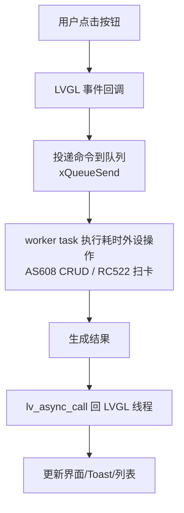

# 模块指南：主 UI（多模式智能门锁）

本 UI 模块负责：

- 界面与交互：Home / 选择开锁方式 / 指纹 / RFID / PIN
- 背景 worker：指纹与 RFID 的耗时外设操作不阻塞 LVGL
- 触发执行器：验证成功后通过队列任务驱动舵机（不在 UI 线程直驱）

相关路径：

- `Application/Src/ui_lock.c`
- `Application/Src/lock_devices.c`（AS608/RC522 初始化任务与 ready 标志）
- `Application/Src/lock_actuator.c`（舵机执行器任务/队列）

## 1. 页面流（状态机视角）

## 2. worker 模型（避免 UI 卡死）

队列与任务：

- 指纹队列：`xQueueCreate(4, sizeof(fp_cmd_t))`
- RFID 队列：`xQueueCreate(4, sizeof(rfid_cmd_t))`
- 指纹 worker：`xTaskCreate(fp_worker, ..., 1024 /*word*/ , ...)`
- RFID worker：`xTaskCreate(rfid_worker, ..., 1024 /*word*/ , ...)`

## 3. 外设 ready 机制（初始化顺序稳定化）

AS608/RC522 的初始化不在 UI 里做，而在 `dev_init` 任务里做：

- 启动：`Core/Src/freertos.c` 调用 `LockDevices_Start()`
- 等待：UI/worker 在需要访问时调用 `LockDevices_WaitAs608Ready()` / `LockDevices_WaitRc522Ready()`

好处：

- 避免“初始化位置挪动就卡死”的时序问题
- 统一在 RTOS 运行后初始化，减少对 SysTick/Delay 的隐式依赖

## 4. 开锁成功后的执行器触发

本地开锁成功（PIN/指纹/RFID）后：

- UI/worker 不直接调用 `mg90s_unlock()`
- 仅调用 `LockActuator_UnlockAsync()` 投递“开锁命令”

执行器动作由 `lock_act` 任务串行执行：

- `mg90s_unlock()` → 保持 `LOCK_ACTUATOR_UNLOCK_HOLD_MS` → `mg90s_lock()`

云端命令（unlock/lock）同样走这条路径（见 `docs/mqtt-control.md`）。

## 5. 开发阶段默认 PIN

`ui_lock_init()` 会在 PIN 库为空时写入默认 PIN `1234`，便于演示与联调。  
生产/论文展示如需安全性论证，建议：

- 移除默认 PIN
- 增加用户授权与操作审计（由后端实现）

