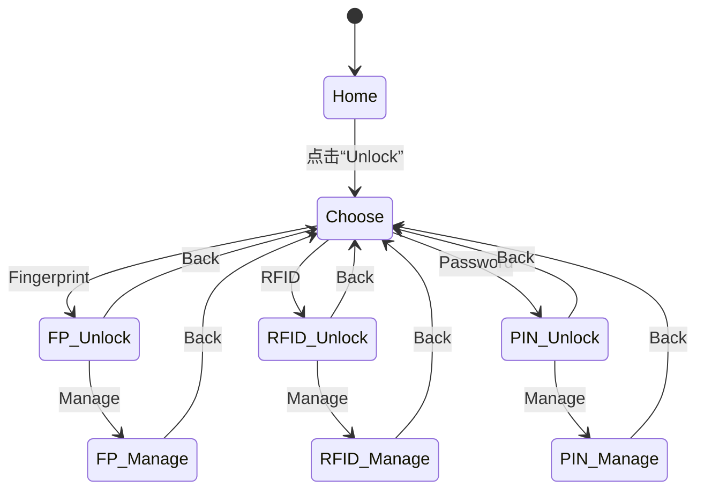
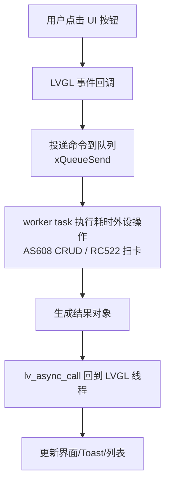

# 模块指南：主 UI（多模态智能门锁）

## 模块职责

- 提供 **门锁主界面**：Home（时间/信息占位）、选择开锁方式、指纹/RFID/密码的“验证/管理”页面。
- 提供 **后台工作线程**：指纹 AS608 与 RC522 扫卡在 worker task 中执行，结果通过 `lv_async_call()` 回到 LVGL 线程更新 UI。
- 管理 **默认凭据与数据源**：启动时初始化 `lock_data`，并写入默认 PIN（开发阶段）。

相关路径：
- `Application/Inc/ui_lock.h`
- `Application/Src/ui_lock.c`

## 页面流（状态机视角）

## 指纹/RFID 的“异步工作流”

## Public API 速查表

| 函数名 | 作用 | 关键参数 | 备注 |
|---|---|---|---|
| `ui_lock_init()` | 构建 UI、初始化外设服务并启动 worker | 无 | **必须在 LVGL handler task 上下文调用**（本项目在 `lvgl_handler_task` 中调用） |

## 关键参数（物理含义）

| 配置项 | 位置 | 含义/影响 |
|---|---|---|
| 默认 PIN `1234` | `Application/Src/ui_lock.c` | 开机后若 PIN 库为空则自动写入，便于演示/联调 |
| `xQueueCreate(4, ...)` | `Application/Src/ui_lock.c` | 指纹/RFID 命令队列深度；过小会丢 UI 请求 |
| `xTaskCreate(..., 1024, ...)` | `Application/Src/ui_lock.c` | worker 栈深度（word）；AS608 CRUD 较耗栈，需预留 |
| 指纹超时（如 8000/15000ms） | `Application/Src/ui_lock.c` | 读/录入的总超时；影响用户等待体验与失败判定 |

## Design Notes（为什么这么写）

- **耗时外设不阻塞 UI**：AS608/RC522 访问可能包含多轮通信与等待手指/卡片，若在 LVGL 线程执行会导致 **界面卡死**；因此采用 worker + `lv_async_call`。
- **数据源集中管理**：RFID/PIN 的增删改查统一走 `lock_data`，避免 UI/云端/本地逻辑各自维护一份模型。
- **调色板抽象**：Home 与子页面用不同 palette，减少“样式散落在控件创建处”的维护成本。

