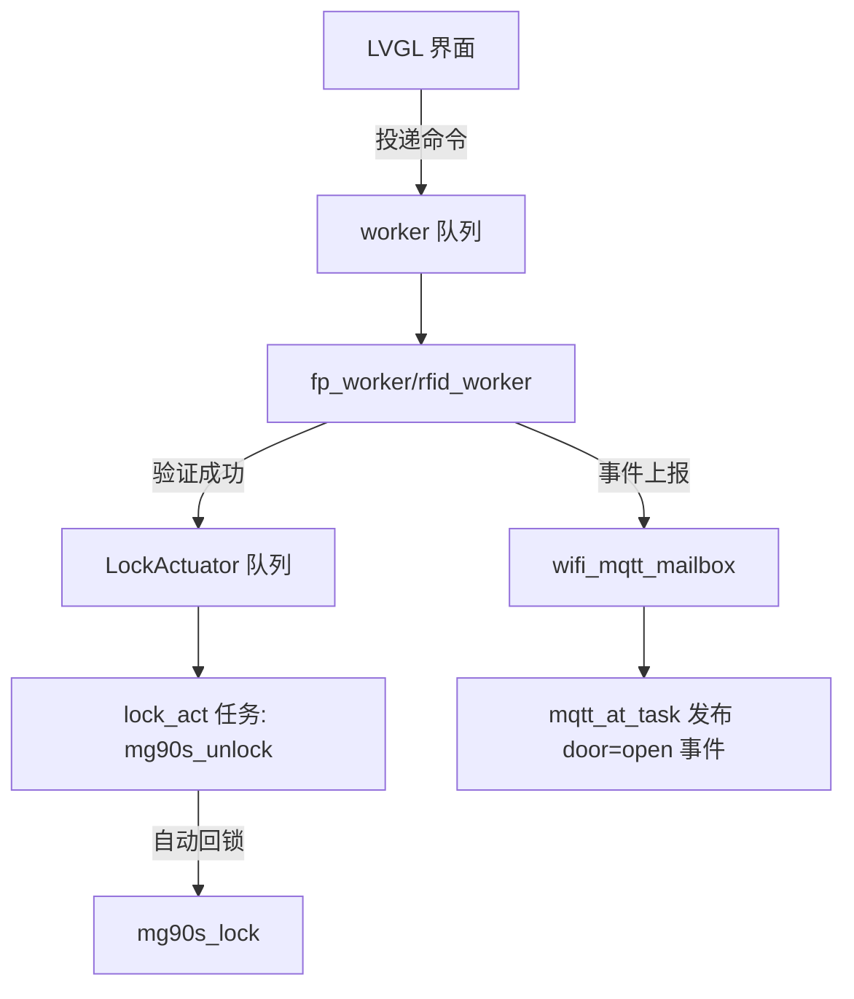
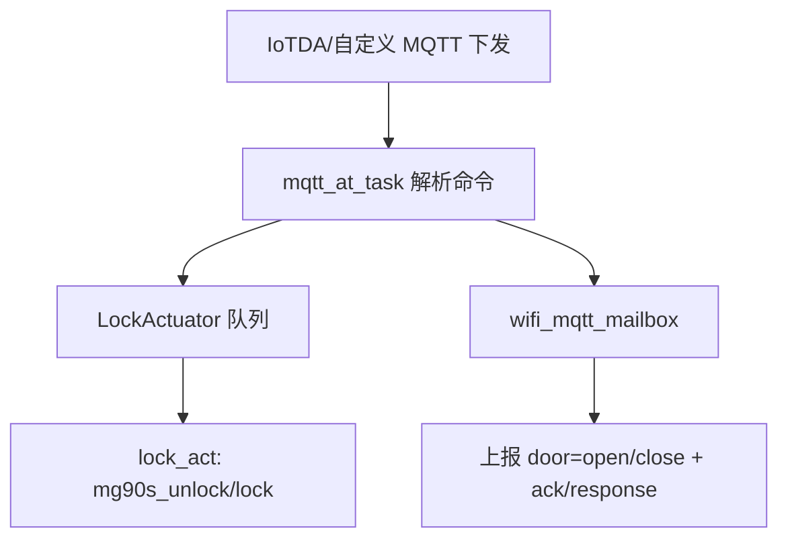

# 系统总体架构（用于论文/前后端对接）

## 1. 系统目标与边界

目标：在 STM32F407 上实现带屏幕的智能门锁面板，支持：

- 本地开锁：指纹（AS608）、RFID（RC522）、密码（触摸 UI PIN）
- 执行器：MG90S 舵机（TIM3 CH1 / PC6）驱动锁舌（开锁后延时自动回锁）
- 云端控制：华为云 IoTDA（ESP-01S + ESP-AT + MQTT），支持云端开锁/关锁命令、上报门事件

边界（当前固件不做的事）：

- 不直接提供 HTTP/REST 服务（由后端桥接 IoTDA/MQTT 实现）
- 不在 MCU 端持久化“大量历史数据”（云端/后端存储）
- 不在 UI 线程直接访问硬件（通过 worker/task/queue 解耦）

## 2. 分层架构（代码目录视角）

```text
Core/                 启动入口、CubeMX 生成、RTOS 入口、HAL 回调分发
Drivers/BSP/          外设驱动（LCD/触摸/AS608/RC522/MG90S/按键...）
components/           可复用组件（log/AT/OSAL/ring_buffer/静态内存池/HFSM...）
platform/             平台抽象（hal_time 等）
Application/          业务与 UI（LVGL、门锁业务、云端任务等）
docs/                 设计与对接文档
```

关键原则：

- LVGL 采用“单线程 UI”模型：只允许 LVGL handler 线程直接调用 LVGL API
- 耗时/阻塞硬件操作（AS608/RC522/MG90S）必须在后台线程执行，UI 只发命令
- 云端命令与本地 UI 使用同一套“执行器任务/队列”，避免并发直驱硬件

## 3. 运行时并发模型（RTOS 视角）

典型任务/线程（以当前工程实际创建为准，详见 `docs/developer-guide/modules/rtos-task-mem-inventory.md`）：

- `lvgl_handler`：LVGL 初始化与 `lv_timer_handler()` 循环（UI 主线程）
- `lvgl_tick`：周期调用 `lv_tick_inc()`
- `fp_worker` / `rfid_worker`：指纹与 RFID 的后台 worker（与 UI 解耦）
- `dev_init`：外设服务初始化（AS608 service、RC522 init，并置 ready 标志）
- `lock_act`：执行器任务（舵机开锁/关锁、开锁保持时间、自动回锁）
- `AT_Core_Task` / `MQTT_AT`：ESP-01S AT 与 MQTT 链路

并发规则（必须遵守）：

1) 任何线程禁止直接操作 LVGL 对象，必须通过 `lv_async_call()` 回到 LVGL 线程
2) 任何 UI 事件回调禁止直接驱动舵机/指纹/RFID；只能向队列/邮箱投递命令
3) 外设初始化必须在调度器启动后执行（避免 delay/us tick 依赖导致卡死）

## 4. 数据流（从“触发”到“执行”）

### 4.1 本地开锁（PIN/指纹/RFID）



### 4.2 云端开锁/关锁



## 5. 协议与数据模型（给 Flutter/后端用）

### 5.1 MQTT 主题与载荷

见：`docs/mqtt-control.md`

### 5.2 事件字段（door event）

当前固件上报 door 事件使用 `key=value` 串（避免 ESP-AT 的复杂转义），常见字段：

- `door=open|close`
- `method=pin|rfid|fingerprint|cloud|unknown`
- `ts=<epoch_s 或上电秒>`

后端建议统一落库字段：

- `device_id`（IoTDA deviceId）
- `event_type`（door）
- `door_state`（open/close）
- `unlock_method`（pin/rfid/fingerprint/cloud）
- `ts`（服务器侧接收时间 + 设备侧 ts）
- `raw_payload`（原始载荷，便于回放/兼容升级）

## 6. 关键工程约束（对论文也有用）

- 初始化顺序敏感：部分驱动使用 `delay_us()`，调度器未启动/时基未就绪时容易卡死；建议所有“非 CubeMX 外设初始化”放到 RTOS 任务中
- 内存敏感：FreeRTOS heap 只有 `36864` bytes，另外还有一个 `MemoryPond` 静态池 `8192` bytes（RingBuffer/Log/AT 使用）
- 可观测性：malloc 失败/栈溢出建议用 hook 断点定位（日志可能因异步/中断上下文无法打印）

